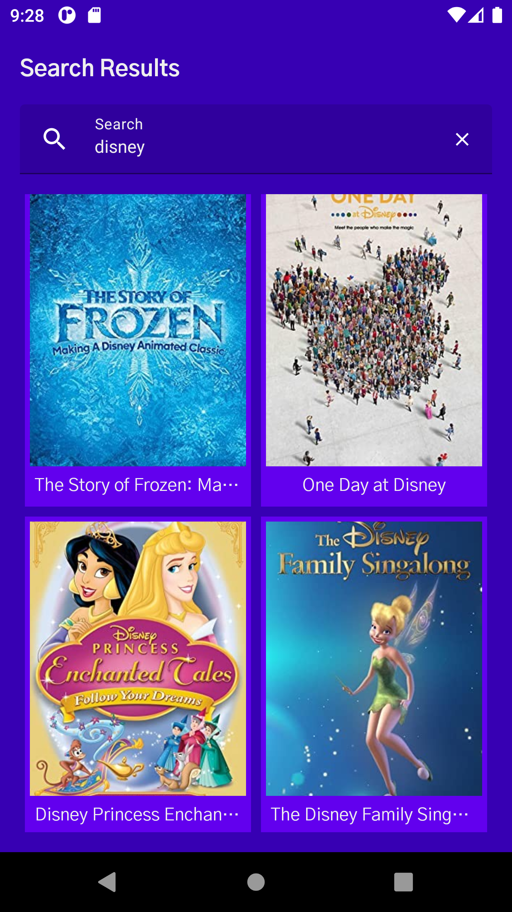
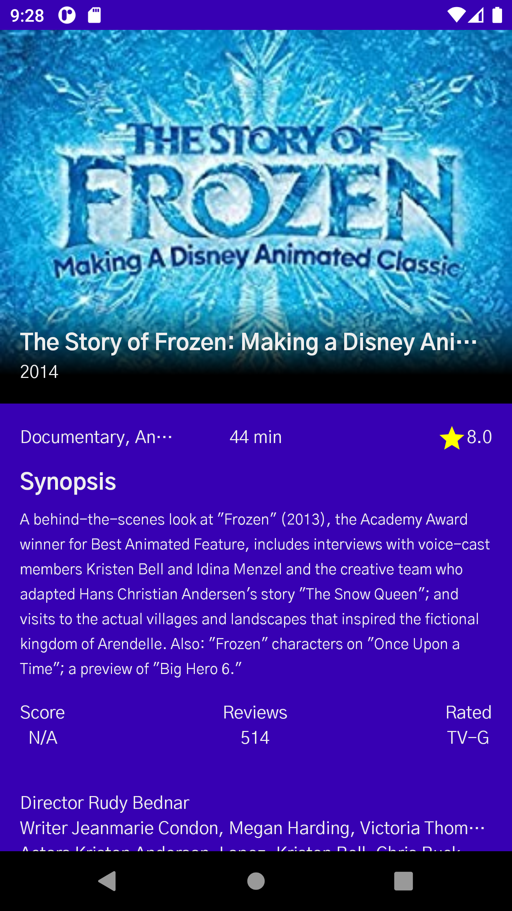

# Movie Search

     

## Prerequisite
- Android Studio Arctic Fox 🦊

## Tech stack
- Jetpack Compose
- MVVM
- Hilt for dependency injection.
- Retrofit2 & OkHttp3 - construct the REST APIs and paging network data.
- Landscapist (Based on top of Glide. Compose image loader with animations) https://github.com/skydoves/Landscapist 
- Network Manger - (https://github.com/mitchtabian/food2fork-compose/blob/master/app/src/main/java/com/codingwithmitch/food2forkcompose/presentation/util/ConnectionLiveData.kt)

